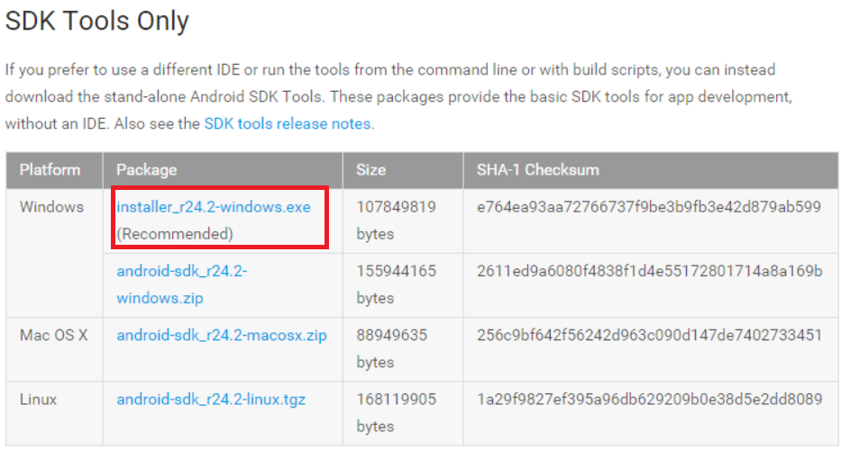

Vides uzstādīšana
======================

Lai varētu sākt darbu pie telefona lietotnes, ir nepieciešams sakārtot vidi.

Java Development Kit (JDK)
------------------------------

Šī ir lietotne, kura kompilē Java programmas.

1. Apmeklē šo lapu http://www.oracle.com/technetwork/java/javase/downloads/index.html
1. Izvēlies lejuplādēt **Java Platform (JDK)**.
1. Sarakstā ar instalācijas failiem dažādām platformām izvēlies **Windows x64** instalāciju.
1. Kad tā ir lejupielādēta, iesāknē to.
1. Izvēlies **Next** visos soļos un JDK uzinstalēsies bez problēmām.

Android SDK
---------------

Šī lietotne ir paredzēta Android lietotnes izveidei.

1. Apmeklē šo lapu https://developer.android.com/sdk/index.html#Other . Ir jāizvēlas rekomendētā programma Windows.

1. Kad tā ir lejupelādēta, iesāknē to.
1. Spiežam **Next** un **Install** pogas. Ja JDK ir uzinstalēts veiksmīgi iepriekšējā solī, tad nekādām problēmām nevajadzētu rasties procesā. Pēdējā solī vajag atļaut sāknēties SDK jeb nenoņemt ķeksi.
1. Ja ir nepieciešams specifiskai ierīcei kompilēt programmu, ir jānoskaidro ierīces OS versija un jāizvēlas SDK API versija.
1. Un beigās jānospiež **Install X packages**. Kad instalācija beidzās, logu var vērt ciet.

Node.JS
---------------

Node.JS ir ļoti plašs pielietojums, bet mūsu gadījumā to vajag, lai uzinstalētu Cordova lietotni.

1. Apmeklē šo lapu https://nodejs.org/
1. Spied pogu **INSTALL**.
1. Sāknē instalāciju pēc lejupielādes.
1. Spied **Next**, **Install** pogas un apstiprini, ka piekrīti lietošanas noteikumiem.

Cordova
---------------

Cordova ir lietotne Android un citu platformu projektu veidošanai. Mēs pamatā apskatīsim tikai Android versiju, bet uzinstalējot Windows Moblie SDK u.c. ir iespējams projektu kompilēt ar Cordova palīdzību dažādām mobilajām OS.

1. Atver "Node.js command prompt".
1. Izpildi komandu ```npm install -g cordova```.
1. Pārbaudi, ka komanda uzinstalēja cordova. Izpildi komandu ```cordova --version```. Ja komanda izvada versiju nevis kādū kļūdu par trūkstošu komandu, tad cordova ir veiksmīgi uzinstalēts.